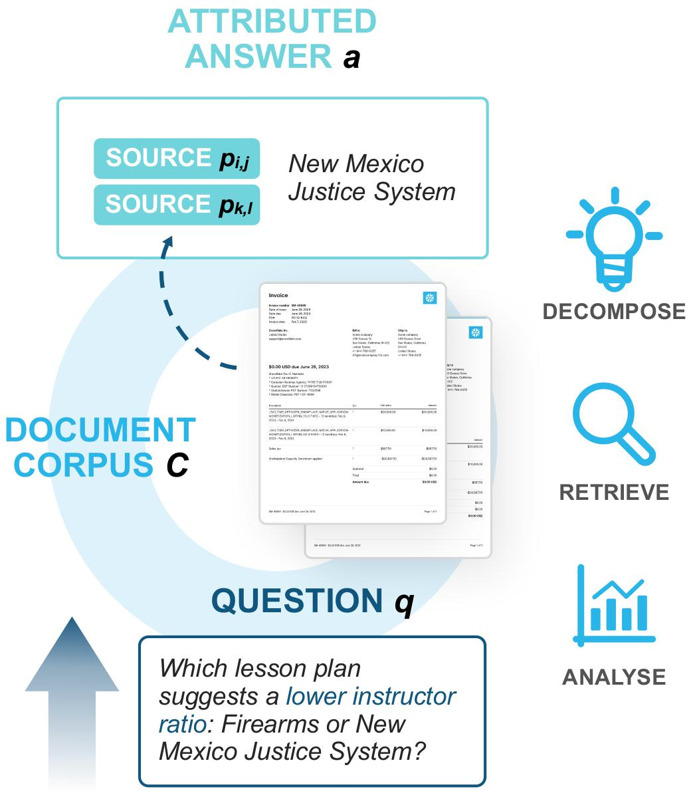
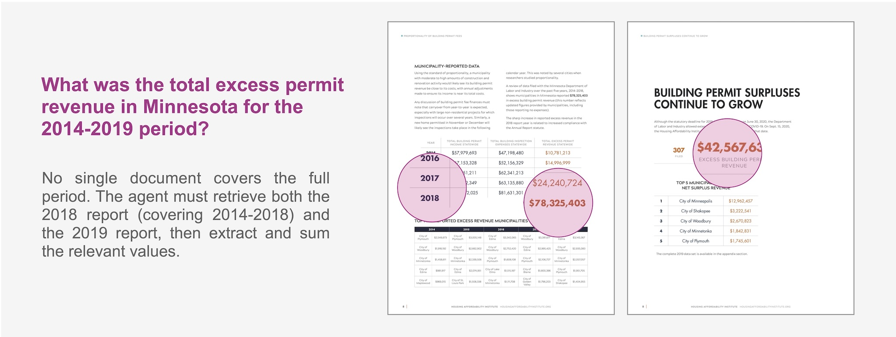

# MADQA: Multimodal Agentic Document QA

Code accompanying the paper *"Strategic Navigation or Stochastic Search? How Agents and Humans Reason Over Document Collections"*.

**Leaderboard**: [`MADQA Leaderboard`](https://huggingface.co/spaces/Snowflake/MADQA-Leaderboard) | **Dataset**: [`OxRML/MADQA`](https://huggingface.co/datasets/OxRML/MADQA) | **Paper**: [`arXiv`](https://arxiv.org/abs/2603.12180)

MADQA is a benchmark of 2,250 human-authored questions grounded in 800 heterogeneous PDF documents, designed to evaluate agentic reasoning over document collections.

<p align="center">
  
  <br>
  <sub>
  <b>Figure:</b> MADQA reasoning workflow. Given a query q over a document corpus C, the agentic system iteratively retrieves pages, reasons over visual and textual content, and aggregates evidence across pages to produce an attributed answer
  </sub>
</p>


## Repository Structure

```
├── baselines/
│   ├── bm25-mllm-agent/    # BM25 MLLM Agent — iterative text search + visual reasoning (§4, App. G.1)
│   ├── recursive-lm/       # Recursive Language Models — programmatic context decomposition (§4, App. G.5)
│   ├── heaven/              # HEAVEN — hybrid visual retrieval (§4, App. G.3)
│   ├── gemini-file-search/  # Gemini File Search — managed RAG service (§4, App. G.2)
│   ├── openai-file-search/  # OpenAI File Search — managed RAG service (§4, App. G.2)
│   └── utils/               # Shared utilities (OCR preprocessing)
├── eval/                    # Evaluation CLI: Accuracy, ANLS*, Semantic Accuracy, Page F1, Kuiper (§3)
├── examples/                # Dataset loading examples
└── LICENSE
```

Each subdirectory has its own README with setup and usage instructions.

## Quick Start

Load the dataset:

```python
from datasets import load_dataset

dataset = load_dataset("OxRML/MADQA")
```

Evaluate predictions:

```bash
pip install -r eval/requirements.txt
python eval/evaluate.py results.jsonl
python eval/evaluate.py results.jsonl --semantic          # with LLM judge
python eval/evaluate.py m1.jsonl m2.jsonl --compare       # compare systems
```

See [`examples/`](examples/) for more.

## Example MADQA Question

<p align="center">
  
  <br>
  <sub>
  <b>Figure:</b> Example MADQA question requiring reasoning across multiple documents. The answer requires retrieving evidence from different reports and aggregating values across years.
  </sub>
</p>


## License

Apache 2.0

## Citation

If you use **MADQA** in your research, please cite:

```bibtex
@misc{borchmann2026madqa,
  title={Strategic Navigation or Stochastic Search? How Agents and Humans Reason Over Document Collections},
  author={Łukasz Borchmann and Jordy Van Landeghem and Michał Turski and Shreyansh Padarha and Ryan Othniel Kearns and Adam Mahdi and Niels Rogge and Clémentine Fourrier and Siwei Han and Huaxiu Yao and Artemis Llabrés and Yiming Xu and Dimosthenis Karatzas and Hao Zhang and Anupam Datta},
  year={2026},
  eprint={2603.12180},
  archivePrefix={arXiv},
  primaryClass={cs.CL},
  url={https://arxiv.org/abs/2603.12180},
}
```
